# 10. Star pattern

- **[1](1.cpp)**

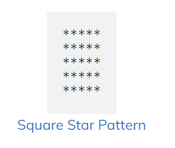

- **[2](2.cpp)**

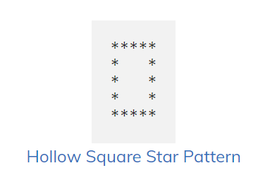

- **[3](3.cpp)**

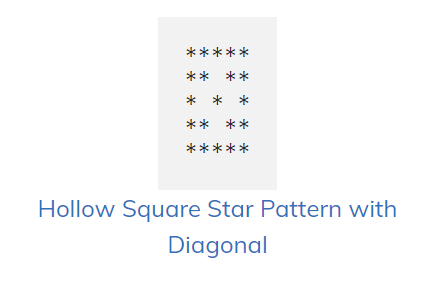

- **[4](4.cpp)**

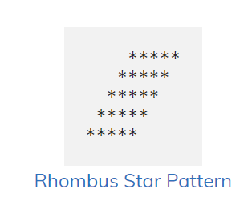

- **[5](5.cpp)**

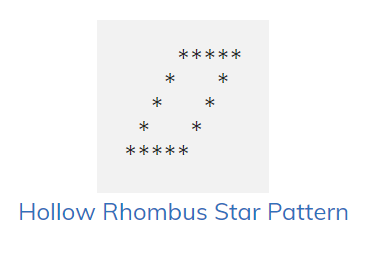

- **[6](6.cpp)**

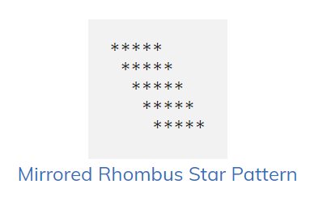

- **[7](7.cpp)**

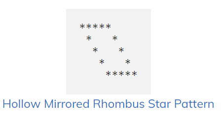

- **[8](8.cpp)**

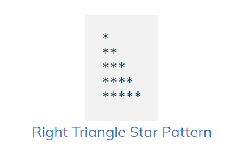

- **[9](9.cpp)**

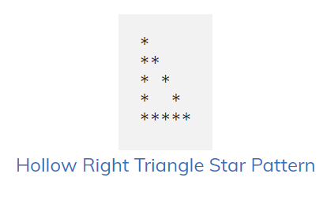

- **[10](10.cpp)**

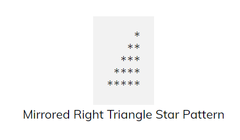1

- **[11](11.cpp)**
-
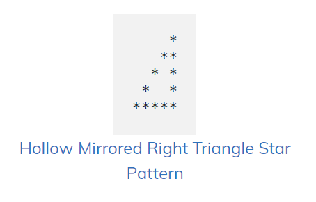

- **[12](12.cpp)**

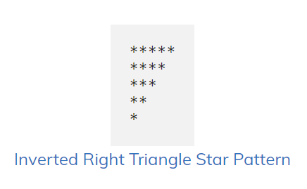

- **[13](13.cpp)**

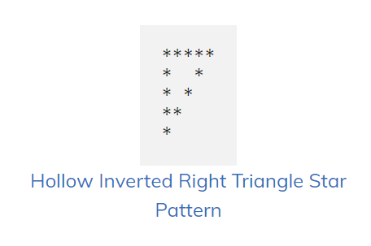

- **[14](14.cpp)**

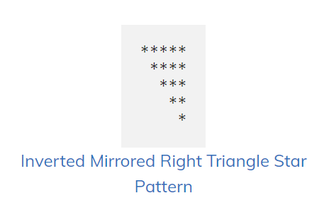

- **[15](15.cpp)**

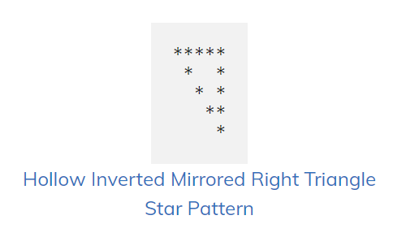

- **[16](16.cpp)**

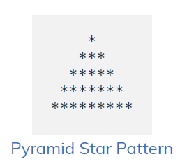

- **[17](17.cpp)**

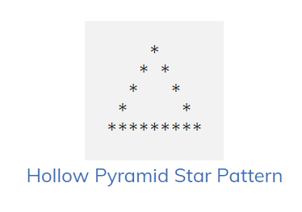

- **[18](18.cpp)**

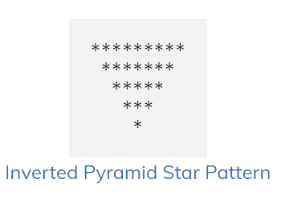

- **[19](19.cpp)**

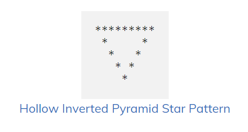

- **[20](20.cpp)**

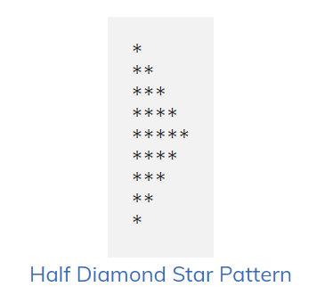

- **[21](21.cpp)**

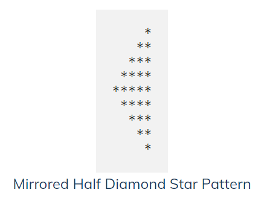

- **[22](22.cpp)**

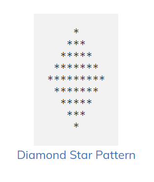

- **[23](23.cpp)**   [In]

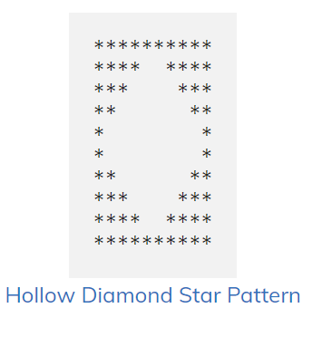

- **[24](24.cpp)**

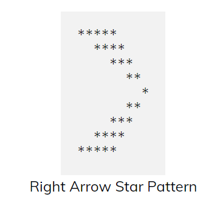

- **[25](25.cpp)**
-
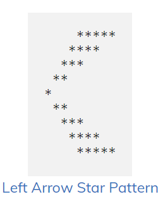

- **[26](26.cpp)**

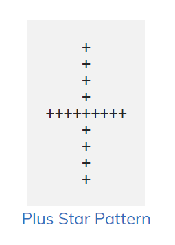

- **[27](27.cpp)**

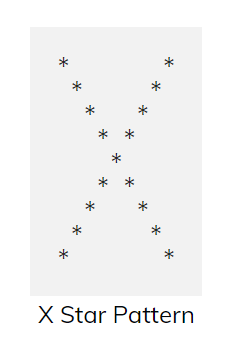

- **[28](28.cpp)**

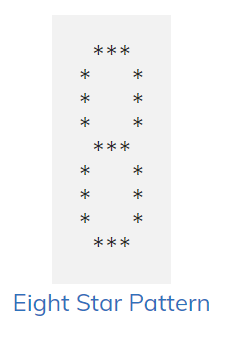