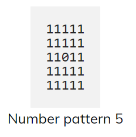
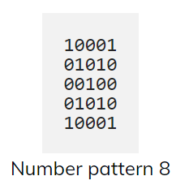
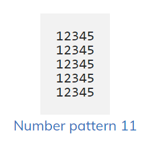
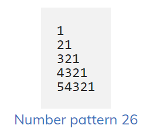

# 11. Number pattern

- **[1](1.cpp)**

- **[2](2.cpp)**

- **[3](3.cpp)**

- **[4](4.cpp)**

- **[5](5.cpp)**

- **[6](6.cpp)**

- **[7](7.cpp)**

- **[8](8.cpp)**

- **[9](9.cpp)**

- **[10](10.cpp)**

1

- **[11](11.cpp)**

- **[12](12.cpp)**

- **[13](13.cpp)**

- **[14](14.cpp)**

- **[15](15.cpp)**

- **[16](16.cpp)**

- **[17](17.cpp)**

- **[18](18.cpp)**

- **[19](19.cpp)**   [In]

- **[20](20.cpp)**

- **[21](21.cpp)**

- **[22](22.cpp)**

- **[23](23.cpp)**

- **[24](25.cpp)**

- **[25](25.cpp)**

- **[26](26.cpp)**

- **[27](27.cpp)**

- **[28](28.cpp)**

- **[29](29.cpp)**

- **[30](30.cpp)**

- **[31](31.cpp)**

- **[32](32.cpp)**

- **[33](33.cpp)**

- **[34](34.cpp)**

- **[35](35.cpp)**

- **[36](36.cpp)**

- **[37](37.cpp)**

- **[38](38.cpp)**

1

- **[39](39.cpp)**

- **[40](40.cpp)**

- **[41](41.cpp)**

- **[42](42.cpp)**

- **[43](43.cpp)**

- **[44](44.cpp)**  [In]

- **[45](45.cpp)**

- **[46](46.cpp)**

- **[47](47.cpp)**

- **[48](48.cpp)**

- **[49](49.cpp)**

- **[50](50.cpp)**

- **[51](51.cpp)**

- **[52](52.cpp)**

- **[53](53.cpp)**
-

- **[54](54.cpp)**

- **[55](55.cpp)**

- **[56](56.cpp)**

- **[57](57.cpp)**

- **[58](58.cpp)**

- **[59](59.cpp)**

C++ Program to Print Pascal Triangle