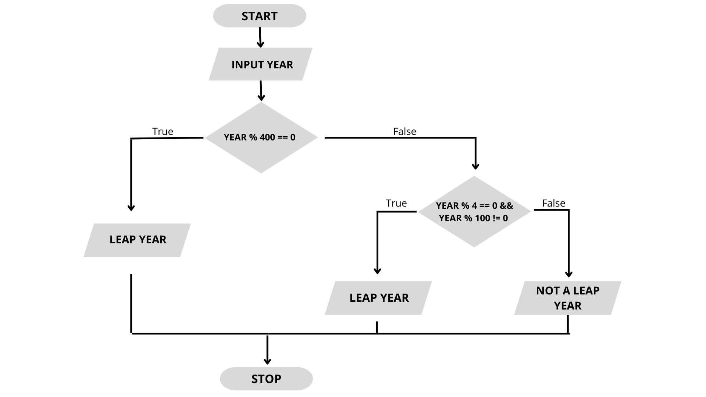

# 1. Simple C++ Programs

[1. C++ Program to Check Whether a Number is Even](1_even_number.cpp)

[2. C program to Check Whether a Number is Positive or Negative](2_positive_negative.cpp)

[3. C++ Program to Find Sum of Digits of a Number](3_sum_of_digit_of_number.cpp)

[4. C++ Program to Reverse a Number ](4_Reverse_of_numer.cpp)

[5. C++ Program to Check if a Number is an Adam Number (A number when squared, reversed, its root is found and is reversed again is equal to the original number, then it is called an Adam number.)](5_Adam_number_check.cpp)

[6. C++ Program to Check Whether a given Year is a Leap Year](6_Leap_year.cpp)

[7. C++ Program to Check Whether a Character is a Vowel, Consonant or Digit](7_vowel_consonent_digit.cpp)

[8. C++ Program to Print ASCII Value of All Characters in the String](8_String_ASCII.cpp)

