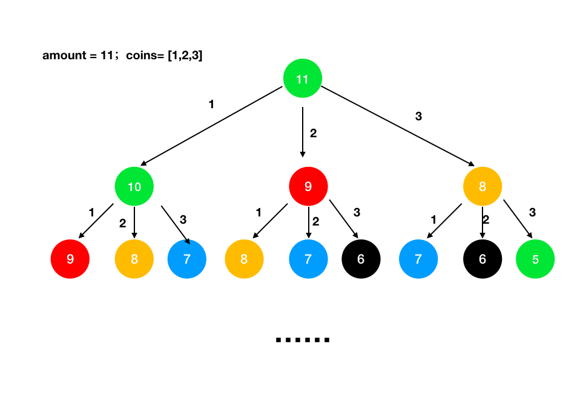
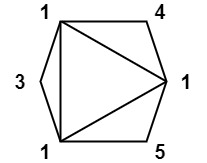

# Dynamic Programming

[1. Fibonacci number (Memorization)](1_fibonacci_number_mem.cpp)   **[---Ques](https://leetcode.com/problems/fibonacci-number/submissions/1268169936/)**

[2. Fibonacci number (Tabulation)](2_fibonacci_number_tab.cpp)

[3. Fibonacci number (space optimization)](3_fibonacci_number_opt.cpp)

[4. Minimum Cost Climbing Stairs (Recursion) ](4_min_cost_climbing_stair_recursion.cpp)  **[---Ques](https://leetcode.com/problems/min-cost-climbing-stairs/)**

[5. Minimum Cost Climbing Stairs (Memorization)](5_min_cost_climbing_stair_mem.cpp)

[6. Minimum Cost Climbing Stairs (Tabulation)](6_min_cost_climbing_stair_Tab.cpp)

[7. Minimum Cost Climbing Stairs (Space optimization)](7_min_cost_climbing_stair_Opt.cpp)

[8. Minimum Number of Coins (Recursion) ](8_min_coin_change_rec.cpp)    **[---Ques](https://leetcode.com/problems/coin-change/description/)**

[9. Minimum Number of Coins (Memorization)](9_min_coin_change_mem.cpp)

[10. Minimum Number of Coins (Tabulation)](10_min_coin_change_tab.cpp)

[11. Maximum Sum of Non-Adjacent Elements (Recursion) ](11_max_sum_nonAdjacent_element_rec.cpp)   **[---Ques](https://www.codingninjas.com/studio/problems/maximum-sum-of-non-adjacent-elements_843261?leftPanelTab=0&utm_source=youtube&utm_medium=affiliate&utm_campaign=Lovebabbar)**

[12. Maximum Sum of Non-Adjacent Elements (Memorization)](12_max_sum_nonAdjacent_element_mem.cpp)

[13. Maximum Sum of Non-Adjacent Elements (Tabulation)](13_max_sum_nonAdjacent_element_tab.cpp)

[14. Maximum Sum of Non-Adjacent Elements (Space optimization)](14_max_sum_nonAdjacent_element_opt.cpp)

[15. House Robbery Problem (Recursion) ](15_house_robbery_rec.cpp)       **[-Ques](https://leetcode.com/problems/house-robber/description/)**

[16. House Robbery Problem (Memorization)](16_house_robbery_mem.cpp)

[17. House Robbery Problem (Tabulation)](17_house_robbery_tab.cpp)

[18. House Robbery Problem (Space optimization)](18_house_robbery_opt.cpp)

[19. Cut Rod into Segments of X, Y, Z (Recursion)](19_cut_rod_into_segment.cpp)      **[-Ques](https://www.codingninjas.com/studio/problems/cut-into-segments_1214651?topList=love-babbar-dsa-sheet-problems&leftPanelTab=0)**

[20. Cut Rod into Segments of X, Y, Z (Memorization)](20_cut_rod_into_segment_mem.cpp)

[21. Cut Rod into Segments of X, Y, Z (Tabulation)](21_cut_rod_into_segment_tab.cpp)

[23. Count derangements (Recursion)](23_count_derangements_rec.cpp)  (ith index doesn't stay at ith position --> how may combination?)   **[-Ques](https://www.codingninjas.com/studio/problems/count-derangements_873861?leftPanelTab=0)**

[24. Count derangements (Memorization)](24_count_derangements_mem.cpp)

[25. Count derangements (Tabulation)](25_count_derangements_tab.cpp)

[26. Count derangements (Space optimization)](26_count_derangements_opt.cpp)

[27. Painting Fence Algorithm (Recursion)](27_painting_fence_rec.cpp)      -**[-Ques](https://www.codingninjas.com/studio/problems/ninja-and-the-fence_3210208?topList=love-babbar-dsa-sheet-problems&leftPanelTab=0)**

[28. Painting Fence Algorithm (Memorization)](28_painting_fence_mem.cpp)

[29. Painting Fence Algorithm (Tabulation)](29_painting_fence_tab.cpp)

[30. Painting Fence Algorithm (Space optimization)](30_painting_fence_opt.cpp)

[31. KnapSack Problem (Recursion)](31_knapsack_problem_rec.cpp)  -**[-Ques](https://www.codingninjas.com/studio/problems/0-1-knapsack_920542?topList=love-babbar-dsa-sheet-problems&leftPanelTab=0)**

[32. KnapSack Problem (Memorization)](32_knapsack_problem_mem.cpp)

[33. KnapSack Problem (Tabulation)](33_knapsack_problem_tab.cpp)

[34. KnapSack Problem (Space optimization - two vector)]()

[35. KnapSack Problem (More Space optimization - one vector)]()

[36. Combination Sum (Recursion)](36_combination_sum_rec.cpp)     -**[-Ques](https://leetcode.com/problems/perfect-squares/submissions/1270166759/)**

[37. Combination Sum (Memorization)](37_combination_sum_mem.cpp)

[38. Combination Sum (Tabulation)](38_combination_sum_tab.cpp)

[39. Perfect Squares Problem (Recursion)](39_perfect_square_rec.cpp)   -**[-Ques](https://practice.geeksforgeeks.org/problems/get-minimum-squares0538/1)**

[40. Perfect Squares Problem (Memorization)](40_perfect_square_mem.cpp)

[41. Perfect Squares Problem (Tabulation)](41_perfect_square_tab.cpp)

[42. Perfect Cube Problem (Recursion)](42_perfect_cude_rec.cpp)

[43. Minimum Cost for Tickets (Recursion)](43_min_cost_ticket_rec.cpp)   -**[-Ques](https://www.codingninjas.com/studio/problems/minimum-coins_2180776?leftPanelTab=0)**

[44. Minimum Cost for Tickets (Memorization)](44_min_cost_ticket_mem.cpp)

[45. Minimum Cost for Tickets (Tabulation)](45_min_cost_ticket_tab.cpp)

[47. Largest Square area in Matrix (Recursion)](47_largest_square_in_matrix_rec.cpp)   -**[-Ques](https://leetcode.com/problems/maximal-square/)**

[48. Largest Square area in Matrix (Memorization)](48_largest_square_in_matrix_mem.cpp)

[49. Largest Square area in Matrix (Tabulation)](49_largest_square_in_matrix_tab.cpp)

[50. Largest Square area in Matrix (Space optimization)](50_largest_square_in_matrix_opt.cpp)

[51. Min Score Triangulation of Polygon (Recursion)](51_min_score_triangle_rec.cpp) -**[-Ques](https://leetcode.com/problems/minimum-score-triangulation-of-polygon/)**

[52. Min Score Triangulation of Polygon (Memorization)](52_min_score_triangle_mem.cpp)

[53. Min Score Triangulation of Polygon (Tabulation)](53_min_score_triangle_tab.cpp)

[54. Minimum Sideways Jump (Recursion)](54_min_sideway_jump.cpp)   -**[-Ques](https://leetcode.com/problems/minimum-sideway-jumps/)**

[55. Minimum Sideways Jump (Memorization)](55_min_sideway_jump_mem.cpp)

[56. Minimum Sideways Jump (Tabulation)](56_min_sideway_jump_tab.cpp)

[57. Minimum Sideways Jump (Space optimization)]()

[58. Reducing Dishes (Recursion)](58_reducing_dishes.cpp)       -**[-Ques](https://leetcode.com/problems/reducing-dishes/)**

[59. Reducing Dishes (Memorization)](59_reducing_dishes_mem.cpp)

[60. Reducing Dishes (Tabulation)](60_reducing_dishes_tab.cpp)

[61. Reducing Dishes (Space optimization)](61_reducing_dishes_opt.cpp)

[62. Longest Increasing Subsequence (Recursion)](62_Longest_increasing_subsequence.cpp)     -**[-Ques](https://leetcode.com/problems/longest-increasing-subsequence/)**

[63. Longest Increasing Subsequence (Memorization)](63_Longest_increasing_subsequence_mem.cpp)

[64. Longest Increasing Subsequence (Tabulation)](64_Longest_increasing_subsequence_tab.cpp)

[65. Longest Increasing Subsequence (Space optimization)](65_Longest_increasing_subsequence_opt.cpp)

[66. Longest Increasing Subsequence (DP + BinarySearch)](66_longest_increasing_subsequence_Binary_search_DP.cpp)

[67. Max Height Cuboid (Rucursion)](67_Max_Height_Cuboid.cpp)      -**[-Ques](https://leetcode.com/problems/maximum-height-by-stacking-cuboids/)** 

[68. Max Height Cuboid (Tabulation)](68_Max_Height_Cuboid_Mem.cpp)

[69. Max Height Cuboid (Tabulation)](69_Max_Height_Cuboid_Tab.cpp)

[70. Max Height Cuboid (Space optimization)](70_Max_Height_Cuboid_Opt.cpp)

[71. Russian Doll (DP + BinarySearch)](71_Russian_doll_BinarySearch_DP.cpp)   -**[-Ques](https://leetcode.com/problems/russian-doll-envelopes/)**

[72. Pizza with 3n size (Recursion)](72_Pizza_with_3n_size.cpp)      -**[-Ques](https://leetcode.com/problems/pizza-with-3n-slices/)**

[73. Pizza with 3n size (Memorization)](73_Pizza_with_3n_size_mem.cpp)

[74. Pizza with 3n size (Tabulation)](74_Pizza_with_3n_size_tab.cpp)

[75. Pizza with 3n size (Space optimization)](75_Pizza_with_3n_size_opt.cpp)

[76. Number of Dice Rolls with Target Sum (Recursion)](76_dice_roll_target_sum.cpp)      -**[-Ques](https://leetcode.com/problems/number-of-dice-rolls-with-target-sum/)**

[77. Number of Dice Rolls with Target Sum (Memorization)](77_dice_roll_target_sum_mem.cpp)

[78. Number of Dice Rolls with Target Sum (Tabulation)](78_dice_roll_target_sum_tab.cpp)

[79. Number of Dice Rolls with Target Sum (Space optimization)](79_dice_roll_target_sum_opt.cpp)

[80. Partition Equal Subset Sum (Recursion) ](80_Partition_equal.cpp)-**[-Ques](https://practice.geeksforgeeks.org/problems/subset-sum-problem2014/1)**

[81. Partition Equal Subset Sum (Memorization)](81_Partition_equal_mem.cpp)

[82. Partition Equal Subset Sum (Tabulation)](82_Partition_equal_tab.cpp)

[83. Partition Equal Subset Sum (Space optimization)](83_Partition_equal_opt.cpp)

[84. Minimum Swap to Make Sequence Increasing (Recursion)](84_minSwapToMakeSeqIncreasing.cpp)-**[-Ques](https://leetcode.com/problems/minimum-swaps-to-make-sequences-increasing/)**

[85. Minimum Swap to Make Sequence Increasing (Memorization)](85_minSwapToMakeSeqIncreasing_mem.cpp)

[86. Minimum Swap to Make Sequence Increasing (Tabulation)](86_minSwapToMakeSeqIncreasing_tab.cpp)

[87. Minimum Swap to Make Sequence Increasing (Space optimization)]()

[88. Longest Arithmetic Subsequence (Recursion)](88_longest_arithmetic_subsequence.cpp)-**[-Ques](https://leetcode.com/problems/longest-arithmetic-subsequence/description/)**

[89. Longest Arithmetic Subsequence (Memorization)](89_longest_arithmetic_subsequence_mem.cpp)

[90. Longest Arithmetic Subsequence (Tabulation)](90_longest_arithmetic_subsequence_tab.cpp)

[91. Longest AP with given Difference "d" (Hashmap)]()   -**[-Ques](https://leetcode.com/problems/longest-arithmetic-subsequence-of-given-difference/)**

[92. Unique Binary Search Trees or Catalan Number (Recursion)](92_unique_binary_tree.cpp)      -**[-Ques](https://leetcode.com/problems/unique-binary-search-trees/)**

[93. Unique Binary Search Trees or Catalan Number (Memorization)](93_unique_binary_tree_mem.cpp)

[94. Unique Binary Search Trees or Catalan Number (Tabulation)](94_unique_binary_tree_tab.cpp)

[95. Guess Number Higher or Lower (Recursion)](95_Guss_Number_Higher_lower.cpp)     -**[-Ques](https://leetcode.com/problems/guess-number-higher-or-lower-ii/)**

[96. Guess Number Higher or Lower (Memorization)](97_Guss_Number_Higher_lower_tab.cpp)

[97. Guess Number Higher or Lower (Tabulation)](97_Guss_Number_Higher_lower_tab.cpp)

[98. Minimum Cost Tree From Leaf Values (Recursion)]() **[-Ques](https://leetcode.com/problems/minimum-cost-tree-from-leaf-values/description/)**

[99. Minimum Cost Tree From Leaf Values  (Memorization)]()

[100. Minimum Cost Tree From Leaf Values  (Tabulation)]()

[101. Buy and Sell Stock [I]](101_Buy_and_Stock_(I).cpp)            -**[-Ques](https://leetcode.com/problems/best-time-to-buy-and-sell-stock/)**

[102. Buy and Sell Stock [II] (Recursion)](102_Buy_and_Stock_(II)_rec.cpp)  -**[-Ques](https://leetcode.com/problems/best-time-to-buy-and-sell-stock-ii/description/)**

[103. Buy and Sell Stock [II] (Memorization)](103_Buy_and_Stock_(II)_mem.cpp)

[104. Buy and Sell Stock [II]  (Tabulation) ](104_Buy_and_Stock_(II)_tab.cpp)

[105. Buy and Sell Stock [II] (Space optimization)](105_Buy_and_Stock_(II)_opt.cpp)

[106. Buy and Sell Stock [III] (Recursion)](106_Buy_and_Stock_(III)_rec.cpp)  -**[-Ques](https://leetcode.com/problems/best-time-to-buy-and-sell-stock-iii/description/)**

[107. Buy and Sell Stock [III] (Memorization)](107_Buy_and_Stock_(III)_mem.cpp)

[108. Buy and Sell Stock [III] (Tabulation) ](108_Buy_and_Stock_(III)_tab.cpp)

[109. Buy and Sell Stock [III] (Space optimization)](109_Buy_and_Stock_(III)_opt.cpp)

[110. Buy and Sell Stock [IV] (Space optimization for k limit) ](110_Buy_and_Stock_(III)_opt_k_limit.cpp)  -**[-Ques](https://leetcode.com/problems/best-time-to-buy-and-sell-stock-iv/)**

[111. Buy and Sell Stock [IV] (Recursion)](111_Buy_and_Stock_(IV)_rec.cpp)

[112. Buy and Sell Stock [IV] (Memorization)](112_Buy_and_Stock_(IV)_mem.cpp)

[113. Buy and Sell Stock [IV] (Tabulation) (problem)](113_Buy_and_Stock_(IV)_tab.cpp) 

[114. Buy and Sell Stock [IV] (Space optimization) (problem)](114_Buy_and_Stock_(IV)_opt.cpp)

[115. Buy and Sell Stock [V] (Recursion) ](115_Buy_and_Stock_(V)_rec.cpp)    -**[-Ques](https://leetcode.com/problems/best-time-to-buy-and-sell-stock-with-transaction-fee/)**

[116. Buy and Sell Stock [V] (Memorization) ](116_Buy_and_Stock_(V)_mem.cpp)

[117. Buy and Sell Stock [V] (Tabulation) ](117_Buy_and_Stock_(V)_tab.cpp)

[118. Buy and Sell Stock [V] (Space optimization) ](118_Buy_and_Stock_(V)_opt.cpp) 

[119. Longest Common Subsequence (Recursion)](119_longest_common_subsequence_rec.cpp)    -**[-Ques](https://leetcode.com/problems/longest-common-subsequence/)**

[120. Longest Common Subsequence (Memorization)](120_longest_common_subsequence_mem.cpp)

[121. Longest Common Subsequence (Tabulation)](121_longest_common_subsequence_tab.cpp)

[122. Longest Common Subsequence (Space optimization)](122_longest_common_subsequence_opt.cpp)

[123. Longest Pelindromic Subsequence (Recursion)](123_longest_pelindromic_common_subsequence_rec.cpp)  -**[-Ques](https://leetcode.com/problems/longest-palindromic-subsequence/)**

[124. Longest Pelindromic Subsequence (Memorization)](124_longest_pelindromic_common_subsequence_mem.cpp)

[125. Longest Pelindromic Subsequence (Tabulation)](125_longest_pelindromic_common_subsequence_tab.cpp)

[126. Longest Pelindromic Subsequence (Space optimization)](126_longest_pelindromic_common_subsequence_opt.cpp)

[127. Edit Distance (Recursion) ](127_Edit_distance_rec.cpp)-**[-Ques](https://leetcode.com/problems/edit-distance/)**

[128. EDIT Distance (Memorization)](128_Edit_distance_mem.cpp)

[129. EDIT Distance (Tabulation)](129_Edit_distance_tab.cpp)

[130. EDIT Distance (Space optimization)](130_Edit_distance_opt.cpp)

[131. Optimal Binary Search Tree](131_Optimal_Binary_Search_Tree.cpp)

