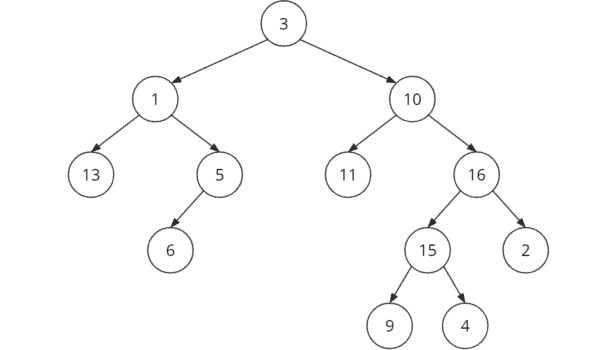

# **Binary Tree**

[1. Preorder print of tree](1_preorder_traversal.cpp)

[2. Inorder print of tree](2_inorder_traversal.cpp)

[3. Postorder print of tree](3_postorder_traversal.cpp)

[4. Build tree from preorder and inorder array](4_buid_tree_pre_inorder_array.cpp)

[5. Build tree from postorder and inorder array](5_buid_tree_post_inorder_array.cpp)

[6. Count no of nodes](6_count_node.cpp)

[7. Calculate height of tree](7_height_of_tree.cpp)

[8. Level order print of tree](8_level_order_print.cpp)

[9. Print Kth level](9_print_k_level.cpp)

[10. Sum of Kth level](10_sum_k_level.cpp)

[11. Every node with sum of its subtree](11_sum_of_subTree.cpp)

[12. Check the tree is balanced](12_check_balance.cpp)

[13. Check the tree is balanced (with pointer pass)](13_check_balance.cpp)

[14. Right view of the tree](14_right_view_Tree.cpp)

[15. Left view of the tree](15_left_view_Tree.cpp)

[16. Calculate Diameter (maximum distance towards two node)](16_diameter_of_tree.cpp)

[17. Calculate Diameter with pointer](17_diameter_of_tree_by_otr.cpp)

[18. Lowest Common Ancestor Finder](18_lowerst_common_ancestor.cpp)

[19. Distance between node to root](19_distance_between_node_to_root.cpp)

[20. Distance between two node](20_distance_between_two_node.cpp)

[21. Print Kth distance node in subtree ](21_print_kth_distance_subTree.cpp)

[22. Find node from tree](22_fiind_node_from_tree.cpp)

[23. Print kth distance nodes from Base](23_print_kth_distance_from_base.cpp)

[24. Sum of all nodes of the tree](24_sum_of_all_node.cpp)

[25. Flutten Binary Tree](25_Flutten_BT.cpp)

