# **Graph Thoery**

## Code Example

<figure>
    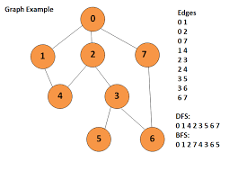
    <figcaption >Undirected Graph-1</figcaption>
</figure>

### Basics of Graph Algorithms

**[1. BFS](1_BFS.cpp)**

**[2. DFS](2_DFS.cpp)**

### Check Cycle

**[3. Check cycle in Undirected Graph (BFS)](3_CheckCycle(BFS).cpp)**

**[4. Check cycle in Undirected Graph (DFS)](4_CheckCycle(DFS).cpp)**

<figure>
    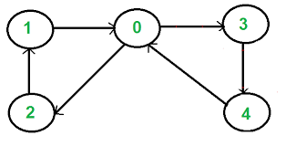
    <figcaption>Directed Graph-1</figcaption>
</figure>

**[5. Check cycle in Directed Graph (DFS)](5_CheckCycleDirected(DFS).cpp)**

**[6. Check cycle in Directed Graph (BFS && Kahn's Algorithm)](6_CheckCycle(BFS_and_Kahns).cpp)**

<figure>
    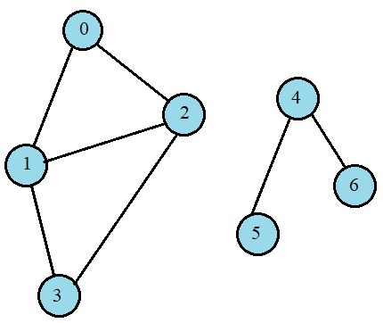
    <figcaption>Disconnected Graph</figcaption>
</figure>

<figure>
    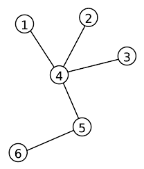
    <figcaption>Undirected Graph-2</figcaption>
</figure>

### Topological Sorting

<figure>
    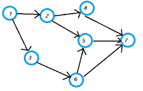
    <figcaption>Directed Acyclic Graph</figcaption>
</figure>

**[7. Topological Sort (using DFS) ](7_topo_sort_DFS.cpp)**

**[8. Topological Sort (Kahn's Algorithm)](8_topo_sort_khans_algo.cpp)**

### Shortest Path in Graph

<figure>
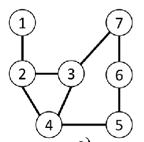
<figcaption>Undirected Graph</figcaption>
</figure>

**[9. Shortest path in undirected graph (BFS)](9_sortest_path_undirected(BFS).cpp)**

**[10. Shortest distance in undirected graph (BFS)](10_shortest_distance_undirected.cpp)**

<figure>
    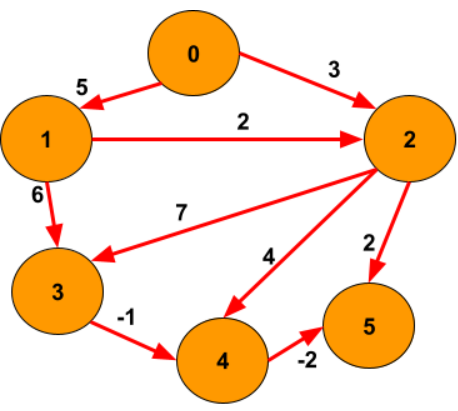
    <figcaption>Weighted Directed Acyclic Graph</figcaption>
</figure>

**[11. Shortest distance form source to all node (weighted DAG)](11_shortest_path_DAG_singleSrc.cpp)**
    

<figure>
    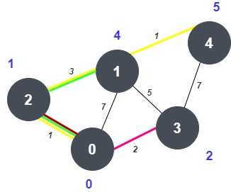
    <figcaption>Weighted Graph-1</figcaption>
 </figure>   
    
**[12. Shortest distance form source to all node (weighted) (Dijkstra Algorithm)](12_shortest_path_single_src_Dijkstra_algo.cpp)**

<figure>
    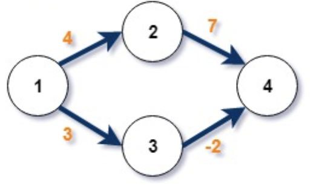
    <figcaption>Weighted Graph-2 (Negative Edge)</figcaption>
</figure>

<figure>
    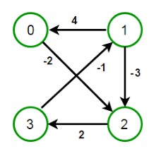
    <figcaption>Weighted Graph-3 (Negative Cycle)</figcaption>
</figure>

**[13. Shortest path in weighted graph with negative edge (Bellmon Ford Algorithm)](13_shortest_path_negative_edge_Bellmon_ford.cpp)**

<figure>
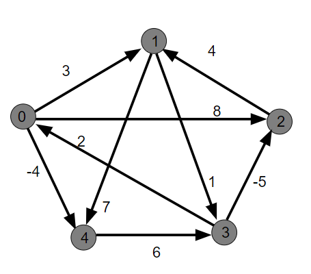

</figure>

**[14. Floyd-Warshal All pair Shortest Path](14_shortest_path_distance_all_pair_FloydWarshal.cpp)**

### Minimum Spanning Tree

<figure>
    
    <figcaption>weightedGraph 4 (For MST)</figcaption>  
</figure>

**[15. Minimum Spanning Tree (Prim's Algorithm)](15_MST_Prims_algo.cpp)**

**[16. Minimum Spanning Tree (Kruskal Algorithm) (disjoint set)](16_MST_Kruskal_algo.cpp)**

### Bridge

<figure>
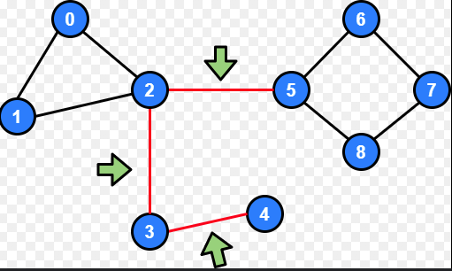
<figcaption>Bridge Graph</figcaption>
</figure>

**[17. Finding Bridge](17_Bridge_of_graph.cpp)**

**[18. Finding Articulation Point](18_Finding_articulation_points_TarjanAlgo.cpp)**

### Strongly Connected Components

<figure>
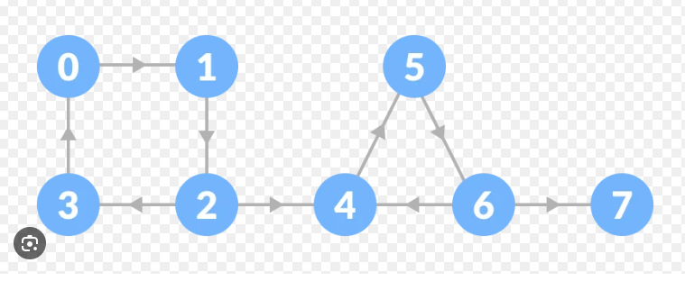
<figcaption>Graph of Strongly Connected Components</figcaption>
</figure>

**[19. Number of Strongly Connected Components (Kosaraju Algorithm)](19_Strongly_connected_components_KosarajuAlgo.cpp)**

**[20. Strongly Connected Components List (Kosaraju Algorithm)](20_Strongly_connected_componentsList_KosarajuAlgo.cpp)**

### Graph Coloring Problem

### Maximum Flow Problem
